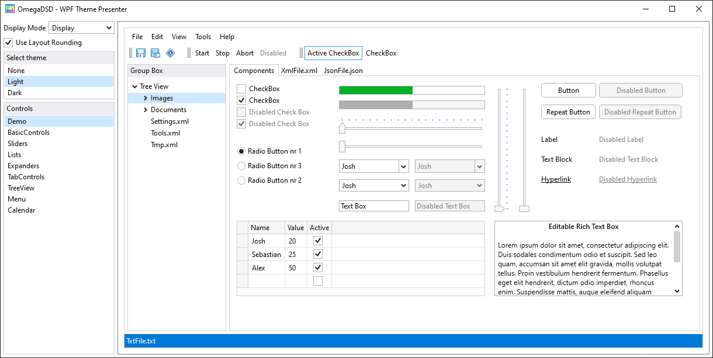
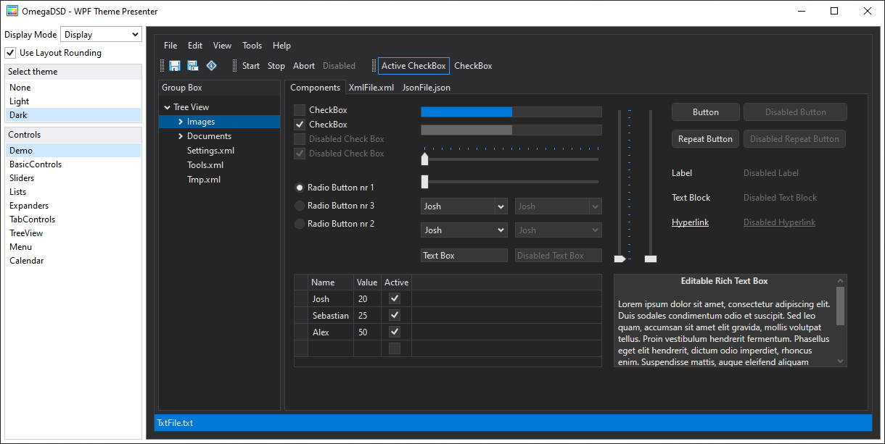

# Free and easy-to-use themes for WPF application

## Light Theme



Styles that has to be explicit assigment:
1. WindowBackground (Window)
2. TextBlockStyle (TextBlock)
3. DataGridCellNoBorderStyle (DataGridCell) - use it to remove border of the selected cell
4. StrechedDataGridStyle (DataGrid) - use it when one or more columns are streched
5. AzureToggleSwitchStyle (CheckBox) - use it to change normal CheckBox to a switch

## Dark Theme



Styles that has to be explicit assigment:
1. WindowBackground (Window)
2. TextBlockStyle (TextBlock)
3. DataGridCellNoBorderStyle (DataGridCell) - use it to remove border of the selected cell
4. StrechedDataGridStyle (DataGrid) - use it when one or more columns are streched
5. AzureToggleSwitchStyle (CheckBox) - use it to change normal CheckBox to a switch

## How to use

1. Copy whole 'Themes' folder and paste it to the WPF project.
3. Choose a theme.
2. Add the resource dictionary of selected theme to the element resource e.g. application resources.

``` xml

<Application.Resources>
    <ResourceDictionary>
        <ResourceDictionary.MergedDictionaries>
            <ResourceDictionary Source="Themes/LightTheme.xaml" />
        </ResourceDictionary.MergedDictionaries>
    </ResourceDictionary>
</Application.Resources>

```

Some controls (such as Window) require an explict assigment of the style and they are listed above in this document under the theme description. Use DynamicResource when you want to change theme in a run time and assigned resoruce key exists in this theme.      
